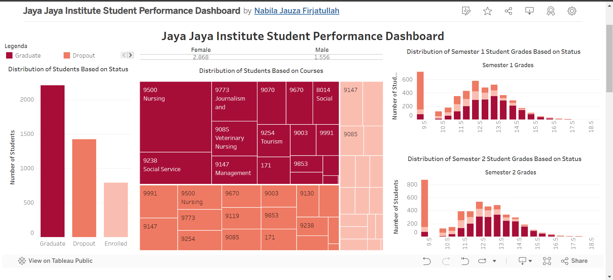

# Proyek Akhir: Menyelesaikan Permasalahan Perusahaan Edutech

## Business Understanding
Jaya Jaya Institut adalah sebuah institusi pendidikan yang berfokus pada peningkatan kualitas pendidikan melalui pengawasan dan evaluasi kinerja mahasiswa. Seiring dengan meningkatnya jumlah mahasiswa yang terdaftar, institusi ini menghadapi tantangan dalam memantau dan meningkatkan performa akademis mahasiswa secara efektif. Salah satu masalah utama yang dihadapi adalah tingginya tingkat dropout atau mahasiswa yang tidak menyelesaikan studinya.

Tujuan utama proyek ini adalah untuk mengidentifikasi faktor-faktor yang mempengaruhi performa mahasiswa dan membuat model prediksi untuk mengidentifikasi mahasiswa yang berisiko tinggi untuk dropout. Dengan demikian, Jaya Jaya Institut dapat mengambil tindakan preventif yang lebih efektif, seperti memberikan bimbingan khusus atau intervensi lainnya, untuk meningkatkan tingkat kelulusan dan performa akademis keseluruhan.

Selain itu, proyek ini juga bertujuan untuk memberikan dashboard interaktif yang dapat digunakan oleh pihak manajemen untuk memantau performa mahasiswa secara real-time dan mengambil keputusan berdasarkan data yang akurat.

### Permasalahan Bisnis
1. Tingkat Dropout yang Tinggi: Tingginya jumlah mahasiswa yang tidak menyelesaikan studi mereka di Jaya Jaya Institut menimbulkan kekhawatiran bagi manajemen. Permasalahan ini dapat berdampak negatif pada reputasi institusi dan mengurangi jumlah pendaftaran di masa mendatang.

2. Kurangnya Identifikasi Dini: Tidak adanya sistem yang efektif untuk mengidentifikasi mahasiswa yang berisiko tinggi untuk dropout sejak dini. Hal ini menyebabkan kurangnya intervensi yang tepat waktu untuk membantu mahasiswa yang membutuhkan.

3. Pemantauan Kinerja Mahasiswa: Kesulitan dalam memantau dan menganalisis performa akademis mahasiswa secara real-time. Hal ini menghambat kemampuan manajemen untuk mengambil keputusan yang berbasis data dalam meningkatkan kualitas pendidikan.

4. Keterbatasan Sumber Daya Bimbingan: Bimbingan akademis yang tidak terfokus pada mahasiswa yang paling membutuhkan bantuan, karena keterbatasan dalam mengidentifikasi mahasiswa dengan performa akademis rendah.

5. Kurangnya Visualisasi Data: Tidak adanya dashboard yang interaktif dan informatif untuk memvisualisasikan data performa mahasiswa. Hal ini menghambat kemampuan manajemen untuk mengidentifikasi tren dan pola dalam performa akademis mahasiswa.

### Cakupan Proyek

1. **Data Collection and Preparation:**
   - Mengumpulkan data mahasiswa dari Jaya Jaya Institut yang mencakup informasi demografis, akademis, dan status pendaftaran.
   - Melakukan pembersihan data untuk memastikan tidak ada data yang duplikat atau missing values.
   - Melakukan eksplorasi data untuk memahami distribusi dan karakteristik data yang tersedia.

2. **Exploratory Data Analysis (EDA):**
   - Melakukan analisis data eksploratif untuk mengidentifikasi pola dan tren dalam data mahasiswa.
   - Memvisualisasikan distribusi nilai dan status mahasiswa berdasarkan berbagai faktor seperti kursus, usia, dan jenis kelamin.
   - Mengidentifikasi fitur-fitur penting yang dapat mempengaruhi tingkat dropout dan performa akademis mahasiswa.

3. **Data Preprocessing:**
   - Melakukan preprocessing data yang mencakup encoding variabel kategorikal, normalisasi fitur numerik, dan pembagian data menjadi set pelatihan dan pengujian.
   - Menyimpan model scaler dan encoder untuk digunakan dalam deployment aplikasi.

4. **Modeling:**
   - Melatih beberapa model machine learning untuk memprediksi status mahasiswa (Graduate, Dropout, Enrolled).
   - Melakukan hyperparameter tuning untuk mendapatkan model dengan performa terbaik.
   - Mengevaluasi model menggunakan metrik akurasi, precision, recall, dan f1-score.

5. **Model Evaluation:**
   - Menggunakan cross-validation untuk memastikan model tidak overfitting dan memiliki generalisasi yang baik.
   - Memvisualisasikan hasil model dengan confusion matrix dan ROC curve.
   - Memilih model terbaik berdasarkan hasil evaluasi.

6. **Dashboard Development:**
   - Membuat dashboard interaktif menggunakan Tableau untuk memantau performa akademis mahasiswa.
   - Menampilkan berbagai visualisasi data yang informatif seperti distribusi nilai mahasiswa per semester, jumlah mahasiswa berdasarkan status, dan jumlah mahasiswa berdasarkan kursus.

7. **Deployment:**
   - Mengembangkan aplikasi berbasis web menggunakan Streamlit untuk memprediksi status mahasiswa berdasarkan input data.
   - Mengintegrasikan model machine learning ke dalam aplikasi untuk memberikan prediksi secara real-time.
   - Menyediakan dokumentasi lengkap untuk pengguna dan pengembang aplikasi.


### Persiapan

Sumber data: [students_performance_data.csv](https://github.com/dicodingacademy/dicoding_dataset/blob/main/students_performance/data.csv)

Setup environment:

1. **Unduh Data**:
   - Unduh file `students_performance_data.csv` dari sumber data yang disediakan.

2. **Instalasi Pustaka yang Dibutuhkan**:
   - Pastikan Anda memiliki Python terinstal di sistem Anda.
   - Buat virtual environment untuk proyek ini (opsional tetapi disarankan).
     ```bash
     python -m venv env
     source env/bin/activate  # Untuk MacOS/Linux
     env\Scripts\activate  # Untuk Windows
     ```
   - Instal pustaka yang dibutuhkan menggunakan `requirements.txt`.
     ```bash
     pip install -r requirements.txt
     ```

3. **Struktur Direktori Proyek**:
   - Buat struktur direktori proyek seperti berikut:
     ```
     submission
     ├───model
     ├───data
     ├───notebook.ipynb
     ├───app.py
     ├───README.md
     ├───<username_dicoding>-dashboard.png (dapat lebih dari 1)
     ├───<username_dicoding>-video.mp4
     ├───Book.twb
     └───requirements.txt
     ```

4. **Menyiapkan Notebook Jupyter**:
   - Buka Jupyter Notebook atau Jupyter Lab dan buka file `notebook.ipynb`.
   - Lakukan analisis data, rekayasa fitur, pemodelan, dan evaluasi di dalam notebook ini.

5. **Menyiapkan File Prediksi**:
   - Buat file `app.py` untuk melakukan prediksi pada data baru menggunakan model yang telah dilatih.
   - Pastikan file `new_data.csv` tersedia dengan format yang sesuai untuk melakukan prediksi.

6. **Membuat Business Dashboard**:
   - Gunakan Tableau Public untuk membuat business dashboard berdasarkan hasil analisis.
   - Simpan screenshot dashboard dengan nama `<username_dicoding>-dashboard.png`.

7. **Dokumentasi Proyek**:
   - Pastikan semua langkah dan analisis terdokumentasi dengan baik di dalam `README.md` dan `notebook.ipynb`.

Dengan melakukan persiapan ini, Anda akan siap untuk melakukan analisis dan pemodelan data mahasiswa Jaya Jaya Institut serta menyusun business dashboard yang diperlukan.

## Business Dashboard

Business dashboard yang telah dibuat bertujuan untuk memberikan wawasan komprehensif mengenai performa mahasiswa di Jaya Jaya Institut. Dashboard ini memvisualisasikan berbagai metrik kunci yang penting bagi manajemen untuk mengambil keputusan yang berbasis data. Dashboard ini dibuat menggunakan Tableau Public dan mencakup beberapa visualisasi utama sebagai berikut:

1. **Distribusi Mahasiswa Berdasarkan Status:**
   - Grafik bar yang menunjukkan jumlah mahasiswa yang telah lulus, dropout, dan masih terdaftar. Visualisasi ini membantu dalam mengidentifikasi jumlah mahasiswa di setiap kategori status.

2. **Distribusi Mahasiswa Berdasarkan Kursus:**
   - Treemap yang menampilkan jumlah mahasiswa di berbagai program studi. Visualisasi ini memberikan wawasan tentang popularitas dan jumlah mahasiswa di masing-masing kursus.

3. **Distribusi Nilai Mahasiswa Semester 1 dan 2 Berdasarkan Status:**
   - Dua histogram yang menunjukkan distribusi nilai mahasiswa di semester 1 dan semester 2 berdasarkan status mereka (Graduate, Dropout, Enrolled). Visualisasi ini membantu dalam memahami bagaimana performa akademik bervariasi di antara kelompok-kelompok tersebut.

4. **Distribusi Mahasiswa Berdasarkan Jenis Kelamin:**
   - Pie chart atau bar chart yang menunjukkan distribusi jumlah mahasiswa laki-laki dan perempuan. Visualisasi ini memberikan informasi tentang proporsi gender di institusi.

### Link untuk Mengakses Dashboard
Dashboard dapat diakses melalui link berikut:
[Link Dashboard Tableau Public](https://public.tableau.com/views/Book_17181109953710/JayaJayaInstituteStudentPerformanceDashboard?:language=en-US&publish=yes&:sid=&:display_count=n&:origin=viz_share_link)

### Screenshots Dashboard
Berikut adalah beberapa screenshot dari dashboard yang dibuat:


Dashboard ini memberikan alat yang kuat bagi manajemen Jaya Jaya Institut untuk memantau kinerja mahasiswa secara real-time, mengidentifikasi tren dan pola penting, serta mengambil tindakan yang diperlukan untuk meningkatkan kualitas pendidikan di institusi.

## Menjalankan Sistem Machine Learning

Untuk menjalankan prototype sistem machine learning yang telah dibuat, ikuti langkah-langkah berikut:

1. **Menyiapkan Model dan Data:**
   Pastikan model yang telah dilatih dan scaler tersimpan di direktori `model/`. Jika belum ada, jalankan notebook untuk melatih model dan menyimpan model yang telah dilatih.
2. **Menjalankan Aplikasi Streamlit:**
   Untuk menjalankan aplikasi Streamlit yang digunakan untuk memprediksi status mahasiswa:
   ```bash
   streamlit run app.py
   ```
3. **Interaksi dengan Aplikasi:**
   - Buka browser dan akses http://localhost:8501.
   - Masukkan data yang diperlukan di form input untuk memprediksi status mahasiswa.
   - Klik tombol "Predict" untuk melihat hasil prediksi.

**Link untuk Mengakses Prototype**
Prototype sistem machine learning dapat diakses melalui link berikut:
[Link Aplikasi Streamlit](https://billafirza-sub2-expertds-idcamp2023.streamlit.app/)

Dengan mengikuti langkah-langkah di atas, Anda dapat menjalankan prototype sistem machine learning dan melakukan prediksi status mahasiswa berdasarkan data input yang diberikan.

## Conclusion

Proyek ini berhasil memberikan solusi komprehensif untuk masalah dropout mahasiswa di Jaya Jaya Institut dengan menggunakan pendekatan data science dan machine learning. Berikut adalah beberapa kesimpulan utama dari proyek ini:

1. **Identifikasi Faktor-Faktor Risiko:**
   - Analisis data menunjukkan bahwa beberapa faktor seperti nilai semester, usia saat pendaftaran, dan status kehadiran memiliki pengaruh signifikan terhadap kemungkinan mahasiswa untuk dropout.
   - Fitur-fitur penting ini telah digunakan dalam model prediksi untuk meningkatkan akurasi dan efektivitas identifikasi risiko.

2. **Model Prediksi yang Akurat:**
   - Model machine learning yang telah dilatih mampu memprediksi status mahasiswa (Graduate, Dropout, Enrolled) dengan akurasi yang tinggi.
   - Model Random Forest dan Logistic Regression dengan regularisasi menunjukkan performa yang baik dalam prediksi.

3. **Dashboard Interaktif:**
   - Dashboard interaktif yang dibuat menggunakan Tableau Public memungkinkan manajemen untuk memantau performa akademis mahasiswa secara real-time.
   - Visualisasi yang disertakan dalam dashboard membantu dalam mengidentifikasi tren dan pola penting yang berkaitan dengan performa mahasiswa.

4. **Prototype Sistem Machine Learning:**
   - Prototype sistem machine learning yang dikembangkan dengan Streamlit memungkinkan prediksi status mahasiswa berdasarkan data input yang diberikan.
   - Prototype ini dapat diakses secara online, memberikan alat yang praktis bagi manajemen untuk melakukan prediksi dan intervensi yang lebih efektif.

5. **Rekomendasi Tindakan:**
   - Berdasarkan hasil analisis dan model prediksi, direkomendasikan untuk memberikan bimbingan dan dukungan tambahan kepada mahasiswa yang berisiko tinggi untuk dropout.
   - Evaluasi program studi dengan tingkat dropout tinggi untuk mengidentifikasi dan mengatasi faktor-faktor yang mungkin menyebabkan mahasiswa tidak menyelesaikan studi mereka.

Dengan kesimpulan ini, diharapkan Jaya Jaya Institut dapat mengimplementasikan solusi yang telah dikembangkan untuk meningkatkan tingkat kelulusan dan performa akademis mahasiswa. Proyek ini menunjukkan bagaimana data science dan machine learning dapat digunakan untuk memberikan solusi yang praktis dan efektif dalam konteks pendidikan.

### Rekomendasi Action Items

Berikan beberapa rekomendasi action items yang harus dilakukan perusahaan guna menyelesaikan permasalahan atau mencapai target mereka:

- **Meningkatkan Dukungan Akademis:**
  - Implementasikan program bimbingan akademis yang ditargetkan untuk mahasiswa dengan performa akademis rendah atau yang menunjukkan risiko dropout. Dukungan ini bisa berupa sesi bimbingan tambahan, workshop, atau tutoring.

- **Pengawasan dan Intervensi Dini:**
  - Gunakan model prediksi yang telah dikembangkan untuk secara proaktif mengidentifikasi mahasiswa yang berisiko tinggi untuk dropout. Lakukan intervensi dini seperti pertemuan dengan konselor akademis atau program dukungan khusus untuk membantu mereka.

- **Evaluasi Program Studi:**
  - Lakukan evaluasi menyeluruh terhadap program studi yang memiliki tingkat dropout tinggi. Identifikasi faktor-faktor yang mungkin menyebabkan mahasiswa tidak menyelesaikan studi mereka dan lakukan perbaikan yang diperlukan dalam kurikulum atau metode pengajaran.

- **Peningkatan Keterlibatan Mahasiswa:**
  - Buat program dan kegiatan yang meningkatkan keterlibatan mahasiswa di kampus, seperti klub, organisasi mahasiswa, atau kegiatan ekstrakurikuler. Keterlibatan yang lebih tinggi dapat meningkatkan rasa memiliki dan komitmen mahasiswa terhadap studi mereka.

- **Peningkatan Komunikasi dengan Orang Tua/Wali:**
  - Tingkatkan komunikasi dengan orang tua atau wali mahasiswa untuk memastikan mereka terlibat dalam perjalanan akademis mahasiswa. Berikan laporan berkala tentang performa akademis dan kegiatan kampus mahasiswa.

- **Pemanfaatan Dashboard untuk Pengambilan Keputusan:**
  - Gunakan dashboard interaktif yang telah dibuat untuk memantau performa akademis mahasiswa secara real-time. Manajemen dapat menggunakan data ini untuk membuat keputusan yang berbasis data dan merespon tren atau masalah yang muncul dengan cepat.

- **Program Pengembangan Keterampilan:**
  - Kembangkan program yang membantu mahasiswa mengembangkan keterampilan tambahan yang relevan dengan studi mereka, seperti keterampilan teknis, soft skills, dan keterampilan manajemen waktu. Program ini dapat membantu mahasiswa merasa lebih siap dan termotivasi untuk menyelesaikan studi mereka.

Dengan mengimplementasikan action items ini, Jaya Jaya Institut dapat meningkatkan tingkat kelulusan mahasiswa, mengurangi angka dropout, dan secara keseluruhan meningkatkan kualitas pendidikan yang diberikan.
